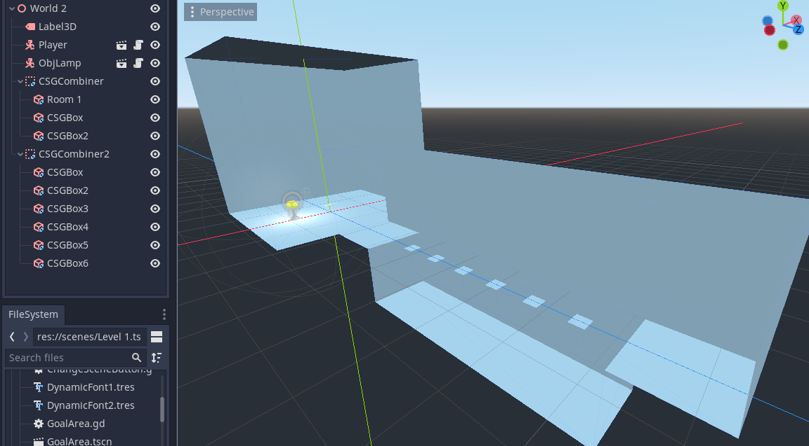
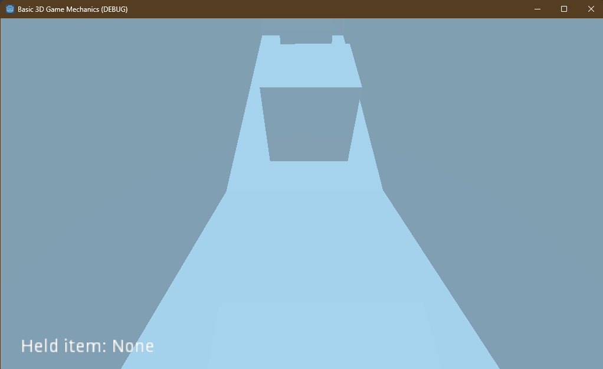

# Tutorial 7

> Latihan: Basic 3D Plane Movement, dan Latihan: Object Interaction
> dikerjakan melalui tahap yang persis dengan tahap yang tertulis pada
> tutorial cukup jelas.

## Latihan: Membuat Level 3D Menggunakan CSG
Terdapat dua level, Level 1 dan Level 2. Pada level 2, ketika pemain jatuh, pemain akan jatuh ke jurang menuju Fail Collision dan level akan direset, sementara pada level 1, pemain memungkinkan memanjat kembali dan melompati platform dari awal. Implementasi level 2 ini dilakukan untuk keperluan Level,  
 *Lakukan hal yang sama untuk area lubang namun dengan Scene Name diisi dengan "Level 1". Supaya ketika player jatuh ke jurang, scene akan di-reload.*
  
  
namun implementasi ini saya jadikan level 2.

### Level 1
Berikut terlampir struktur Nodes dan tampilan Level 1 (World 1). 
 
World 1 sendiri adalah struktur level secara umum, mengikuti Tutorial, sementara Level 1 adalah World 1 disertai dengan goal condition di ujungnya.

 
 
Layout level dibentuk pada CSGCombiner (persis mengikuti Tutorial), sementara *slope*, dan kotak-kotak platform dibentuk pada CSGCombiner2.

### Level 2
Berikut terlampir struktur Nodes dan tampilan Level 2 (World 2). 
 
World 2 sendiri adalah struktur level secara umum, mengikuti Tutorial, sementara Level 1 adalah World 1 disertai dengan goal condition di ujungnya.

 
 
Layout level 2 juga merupakan layout level 1 tanpa *slope* dan disertai dengan fail collision pada lubang.

## Latihan Mandiri: Eksplorasi Mechanics 3D
Terdapat empat implementasi mechanic tambahan, yaitu pick up, sprint, crouch, dan inventory (satu item saja). 

### Pick Up
Ketika mencoba level, terkadang warna platform dengan warna jurang *nyaru* sehingga ujung platform sulit dilihat.  

 
Oleh karena itu, terpikirlah ide untuk menambahkan cahaya agar platform-platform tersebut mudah dilihat. Karena objek lampu sudah ada, muncullah ide untuk membuat objek tersebut menjadi menghasilkan cahaya dan dapat di pick up dan dibawa selagi player berjalan, menerangi jalan. Dipasangkanlah OmniLight dengan jangkauan yang cukup jauh pada lampu tersebut.

 
 
Implementasi kode posisi lampu yang tetap relatif terhadap kamera memerlukan waktu yang cukup lama untuk diimplementasikan. Setelah beberapa percobaan dan riset, saya menemukan [sumber ini](https://docs.godotengine.org/en/stable/tutorials/3d/using_transforms.html) yang sangat membantu. Lebih tepatnya membantu menghilangkan overthink saya terhadap Aljabar Linear.
 
 
Berikut terlampir kode dari objek lampu tersebut.

 
Objek lampu dipasangkan kode yang extends Interactable. Status berubah ketika di-*interact* dan pasang objek yang berinteraksi dengannya pada variabel body. Jika status objek sedang dipegang (`moving`), posisi global benda akan diubah menjadi posisi (3, 0, -3) (serong depan kanan) relatif terhadap posisi kamera objek tersebut.

### Inventory dan UI Tambahan
Mengikuti implementasi lampu, implementasi inventory juga dibuat. Namun, alih-alih inventory yang dapat meyimpan banyak item, inventory hanya ada berupa picked-up item (satu item saja). Hal ini dilakukan karena saya rasa untuk menambahkan objek lain tidak begitu diperlukan/membantu untuk mencapai goal. Inventory hanya berupa Label3D yang menempel pada Camera Player. 

 
Bagian awal level juga ditambahkan teks yang menyuruh pemain untuk mengambil lampu tersebut, memberitahu pemain bahwa pemain bisa berinteraksi dengan lampu tersebut. 

 
Selain itu, ditambahkan juga Main Menu, Stage Select, Game Over Screen, dan Win Screen yang ditambahkan sebagai bentuk polishing. Implementasi menu sama persis (copy-paste dengan penyesuaian) dengan menu yang diimplementasikan pada tutorial 6. 

 

### Sprint dan Crouch
Dua mechanic ini diimplementasikan dengan state. State berubah selama tombol sprint ditekan, sementara hilang ketika tombol sprint dilepas. Crouch juga serupa. Kedua state memiliki kecepatan jalan masing-masing, sementara crouch memiliki implementasi tambahan yaitu menurunkan camera dan collision Player ketica crouch.
 

 
